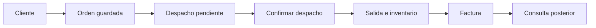

# Alineación con la rúbrica del proyecto de escritorio

Revisión: 2 de octubre de 2026. Demostración: sábado 3 de octubre de 2026.

Fuente revisada completa: `C:\Users\marlo\Downloads\Entrega Final del Proyecto de escritorio - Programación II.pdf`, cinco páginas. Se aplican las indicaciones generales, el flujo de Ventas, la rúbrica de 5 puntos y la demostración presencial. Hotel corresponde al otro tipo de proyecto; Android/API es la fase posterior y no se evalúa en estos 5 puntos.

## Matriz de evidencia

| Criterio del ingeniero | Valor | Evidencia disponible | Estado |
|---|---:|---|---|
| Modelo y base de datos | 0.75 | 14 tablas; PK, FK, UNIQUE y CHECK; encabezados y detalles persistidos; `script_base_datos_ventas.sql`; recuperación de entidades con producto, categoría y bodega completos | Verificado técnicamente |
| POO y organización del código | 0.75 | Entidades con atributos privados; objetos y enumeraciones; interfaces DAO con implementaciones JDBC; vista → controlador → servicio; transacciones en servicios/DAO | Revisado en código |
| Interfaz, navegación y mantenimientos | 0.50 | Menús Swing; clientes, categorías, productos y bodegas; entradas de inventario; validaciones; búsqueda por fechas; recarga de bodegas al volver al inventario | Ensayo automatizado y revisión de renderizados |
| Flujo principal completo | 1.50 | Cliente → OV → DSP pendiente → confirmación → salida de inventario → FAC → consulta; `ensayoCompletoDesdeMenusSwing` | Aprobado contra SQL Server |
| Reglas de negocio y consistencia | 0.75 | Stock permanece al guardar/generar; rebaja única al confirmar; rollback, insuficiencia, duplicados, concurrencia, precios históricos y relación factura/orden | Aprobado en pruebas unitarias e integración |
| Presentación y dominio | 0.75 | Guion, preguntas y recorrido de código en `defensa_proyecto.md` y `guion_entrega.md` | Cada integrante debe practicar y presentarse |

Los criterios técnicos tienen evidencia de implementación y verificación. El resultado de la evaluación presencial y el dominio del grupo los determina el docente; no se asigna una nota automática.

## Los ocho pasos obligatorios de Ventas

| Paso del documento | Cómo demostrarlo |
|---|---|
| 1. Registrar o seleccionar cliente | CATÁLOGOS → Clientes. Guardar y volver a consultarlo; o seleccionar CF en la orden |
| 2. Consultar/seleccionar productos con existencia | INVENTARIO → Inventario (Existencias). Anotar stock y bodega; seleccionar el producto en Nueva Orden de Venta |
| 3. Crear orden con encabezado y detalle | Guardar una OV con cliente, usuario, fecha y líneas de producto/cantidad/precio |
| 4. Validar inventario suficiente | Intentar una cantidad superior al disponible; el sistema rechaza y no rebaja stock |
| 5. Confirmar orden y generar despacho relacionado | Guardar OV; en Despachos seleccionar esa OV y bodega; generar DSP PENDIENTE, entregado cero |
| 6. Confirmar despacho y rebajar existencias | Confirmar DSP: OV COMPLETADA, DSP CONFIRMADO, una SALIDA por producto y stock S−cantidad |
| 7. Generar factura | VENTAS → Facturación de órdenes despachadas. Cargar OV y emitir FAC con sus precios históricos |
| 8. Consultar posteriormente las relaciones | Buscar por fechas; Ver operación; reiniciar el sistema y consultar FAC; mostrar `verificar_operacion.sql` si lo pide el docente |



| Momento | Stock esperado para vender 5 |
|---|---:|
| Antes de la orden | S |
| Orden guardada | S |
| Despacho generado | S |
| Despacho confirmado | S−5 |
| Factura emitida | S−5 |

## Ajustes del cierre

- La consulta consume la fecha recién escrita y rechaza días inexistentes; un error vacía los resultados anteriores.
- Inventario recarga el listado de bodegas conservando el filtro seleccionado; registrar entradas se coordina desde el controlador.
- Guardar una orden verifica en la BD que sus productos sigan activos, incluso si otra ventana los desactivó.
- Los DAO de existencias y movimientos recuperan las relaciones completas y propagan los errores. La edición/eliminación de movimientos históricos se rechaza explícitamente.
- La recuperación de la venta se valida en una JVM nueva. El rango incluye tanto el inicio como el final del día y excluye días adyacentes.
- `scripts/demostracion.cmd` permite verificar el proyecto y abrirlo con dependencias locales, sin cambiar la política permanente de PowerShell.

## Evidencia reproducible

```powershell
.\scripts\demostracion.cmd -Modo Verificar
```

Resultado registrado el 2 de octubre: 48 pruebas, 0 fallos, 0 errores, 0 omitidas: 36 sin SQL y 12 de integración. El cierre del 3 de octubre incorpora dos regresiones adicionales para entradas sobre productos y bodegas desactivados; sus resultados están en `verificacion_implementacion.md`. Reportes en `target/surefire-reports`; evidencia de recuperación independiente en `target/persistencia-jvm.txt`; renderizados en `target/ui-qa`.

Consulta de solo lectura posterior a las pruebas: 14 tablas, 24 productos activos; sin productos, clientes o bodegas IT residuales; ninguna FK/CHECK deshabilitada o no confiable; stock válido. Se conservan la orden, despacho y factura anteriores. TEC-001 vale Q95.00 y tiene 19 unidades en Bodega Central al revisar. Durante la demo vuelva a consultar la existencia real.

## Preparación de los tres integrantes

1. Cada integrante debe ejecutar los ocho pasos y explicar por qué la rebaja ocurre en el despacho.
2. Practiquen la recuperación tras cerrar y relanzar la aplicación y la consulta por fechas del día de la demo.
3. Cada uno debe explicar una clase, una interfaz DAO, una FK y el rollback. Alternen cliente/orden, despacho/inventario y factura/consulta.
4. Registren su ensayo humano en la tabla de `guion_entrega.md`. Todos deben asistir.
